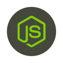

<h1 align="center">Node.js Starter ToolKit</h1>

    
     
    <i>Foundation project for backend Node.js applications with TypeScript</i>

  <a href="https://vitorsalgado.github.io/nodejs-boilerplate/"><strong>vitorsalgado.github.io/nodejs-boilerplate</strong></a>
   

  <a href="CONTRIBUTING.md">Contributing Guidelines</a>
  ·
  <a href="https://github.com/vitorsalgado/nodejs-boilerplate/issues">Submit an Issue</a>
  ·
   
   

  &nbsp
  &nbsp

## License

This project is [MIT Licensed](LICENSE).
